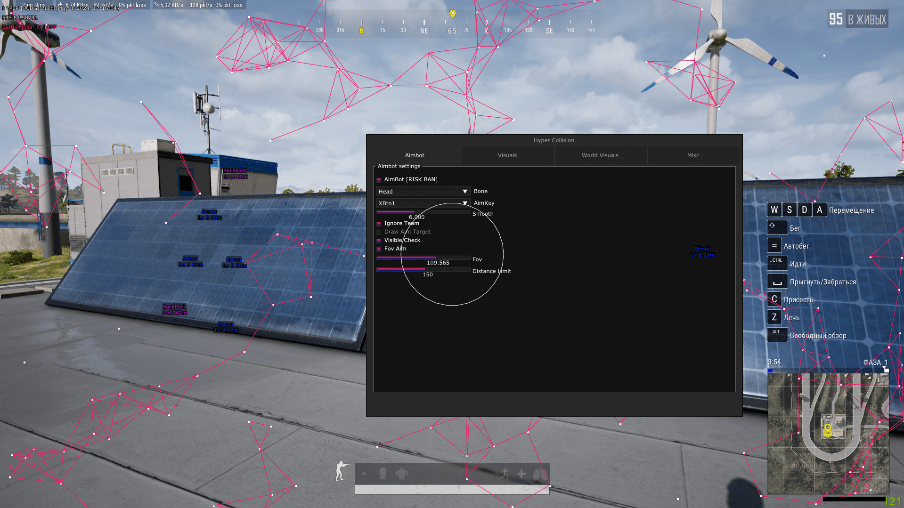

Specifications:

Supports Windows 10 / 11 starting from version 2004 (with Hyper-V support)
Compatible with Intel and AMD processors.
You can play in Windowed Mode, Borderless

System requirements:

Disable Windows Defender and Smart Screen
Remove Faceit, Vanguard anti-cheats
Disable Secure boot
Enable Hyper-V virtualization
Bios Type: UEFI

<h1 align="center">
	
	 
	 
</h1>
✅✅✅### password: External-pubg-free

AimBot [Use at own risk]

    Enable
    Memory Type Aim
    Mouse Type Aim
    Visible Check
    Target Line
    Aim Fov
    Smooth
    Aim Key
    Bone Select
    Recoil Control

ESP

    Spectators
    Visible Check
    Distance
    Team
    HP Top
    HP Left
    HP Text
    Skeleton
    Head Point
    2D Box
    3D Box
    Corner Box
    Line
    Radar
    Radar scale

Misc

    CrossHair
    AntiScreen

ESP Loot

    Armor
    Heal
    Boost
    Helmet
    Weapon
    Melle Weapon
    Ammo
    Weapon
    Backpack
    Deathdrop
    AirDrop
    Vehicle
    Vehicle HP
    Vehicle Fuel
    Distance to object

